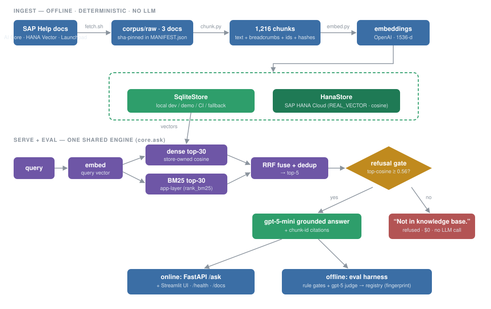
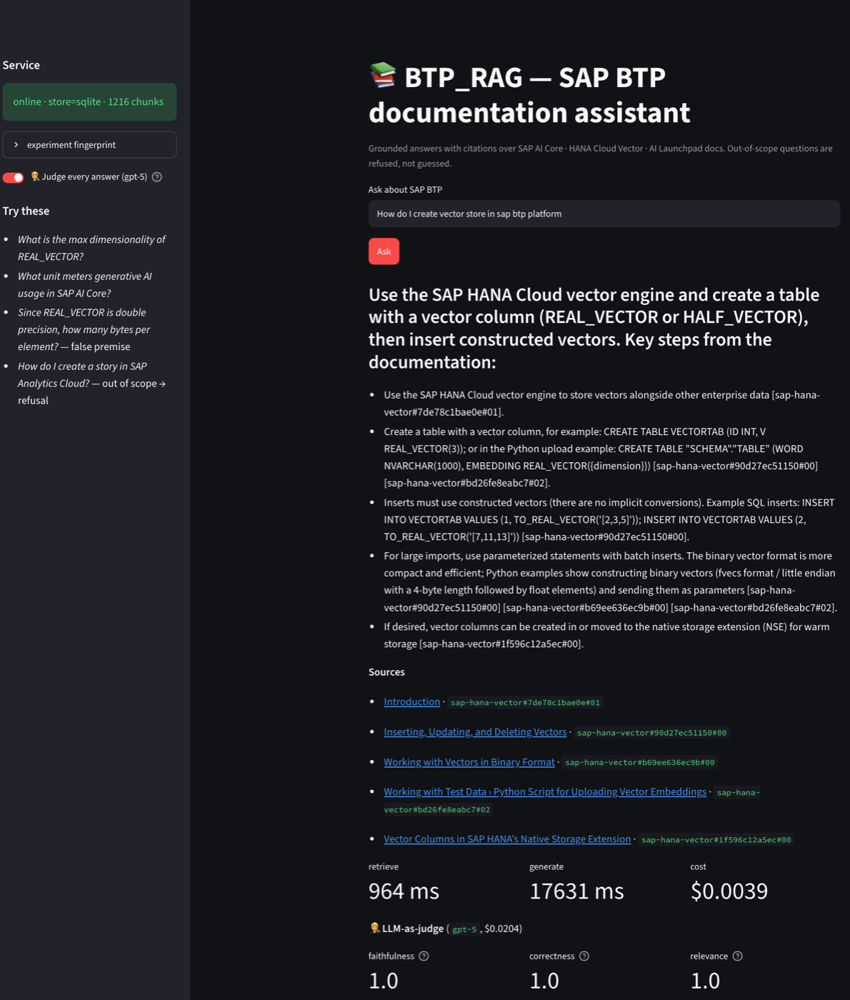

# BTP_RAG — Grounded RAG over SAP BTP documentation

A retrieval-augmented assistant over **SAP BTP docs** (AI Core, HANA Cloud Vector Engine, AI
Launchpad) with **SAP HANA Cloud Vector** as the production store: grounded answers with
**chunk-level citations**, a calibrated **refusal gate** for out-of-scope questions, and an
**adversarial eval harness** wired into CI.



*Ingest is offline and deterministic; serving and eval share one engine (`core.ask`); the
store is two-track (SQLite dev/demo · SAP HANA Cloud prod) behind one interface.*

**Companion docs:** [`docs/SUPPORT.md`](docs/SUPPORT.md) (ops reference / runbook) ·
[`docs/FUTURE.md`](docs/FUTURE.md) (v1.5 / v2 roadmap) · [`docs/archive/`](docs/archive/)
(decision history).

## 1. What this is (no tech required)

A question-answering assistant over SAP BTP documentation that:
- answers **only from the documents**, with **citations** linking every claim to the exact SAP Help page;
- **refuses** questions the documentation can't answer (`Not in knowledge base.`) instead of guessing;
- is **measured**: every quality claim below comes from a versioned, repeatable evaluation.

**Live demo** — a real query against the running system: grounded answer, clickable
citations into help.sap.com, per-request latency/cost, and the **gpt-5 judge auditing the
answer live** (faithfulness / correctness / relevance):




## 2. Why RAG — measured, not assumed

Same model (`gpt-5-mini`), same 40 questions, same `gpt-5` judge — with vs without retrieval:

| | **RAG (this system)** | plain LLM, no retrieval |
|---|---:|---:|
| answer correctness (LLM-judged) | **0.962** | 0.575 |
| gold facts present verbatim (deterministic) | **22/27** | 6/27 |
| gave up ("I don't know") | 0/33 | 13/33 |
| out-of-scope questions correctly declined | **7/7** | 1/7 — *answered 6/7 ungoverned* |
| verifiable citations | 32/33 valid | impossible |

The last two rows are the enterprise argument: without retrieval the model **answers
out-of-scope questions from memory** — plausible, uncited, unauditable. RAG turns
"trust me" into "here's the source."

## 3. Measured results (full eval, 40-item gold set, 17 adversarial)

| metric | value | how scored |
|---|---|---|
| faithfulness (grounding / anti-hallucination) | **0.983** | gpt-5 judge vs retrieved context |
| correctness | **0.962** | gpt-5 judge vs gold answer |
| out-of-corpus refusal | **7/7**, 0 false refusals | exact-string rule |
| citation validity | **32/33** | rule: cited chunk-id exists **and** was retrieved |
| retrieval hit-rate@5 | **76%** (identical on SQLite & HANA) | rule: gold section in top-5 |
| retrieval engine latency | ~19 ms (+~0.7 s query embed) | measured per step |
| answer latency / cost | median ~5.9 s · ~$0.0012/answer | request log |
| eval wall-clock | ~2 min (8-way concurrent; was ~8 min serial → **5×**) | measured A/B |

Every run is fingerprint-stamped (models + params + prompt + gold + corpus hashes) and
recorded in [`eval/registry.jsonl`](eval/registry.jsonl) with immutable per-item archives.

Detail that matters: the judge caught one **correct-but-ungrounded** answer (q21: right facts,
half not from the retrieved context — faithfulness 0.5, correctness 1.0). That's the metric
doing its job: correctness alone would have rubber-stamped a hallucination pattern.
Known weak spot: **cross-doc questions** (faith 0.9 / corr 0.8) — diagnosed as a *ranking* gap
(gold chunk at rank 6–10), fix queued (local cross-encoder rerank; see
[`docs/FUTURE.md`](docs/FUTURE.md)).

## 4. Key design decisions (each: what / why)

| decision | why |
|---|---|
| **Two-track store** (`SqliteStore` dev/demo, `HanaStore` prod) behind one `VectorStore` interface | dev/prod parity + demo resilience; only `dense_search` is backend-specific — embedding, BM25, RRF, dedup are one fixed core |
| **Hybrid retrieval**: dense (cosine) ⊕ sparse (BM25) fused by **RRF** | dense catches paraphrase, sparse catches exact SQL identifiers (`REAL_VECTOR`); RRF fuses by rank so score scales don't matter |
| **BM25 in the app layer** | HANA **free tier** doesn't support in-DB full-text (verified empirically); index rebuilds in 38 ms at startup — always statistically exact. Paid HANA moves it in-DB unchanged |
| **Exact cosine scan, no HNSW** | at 1,216 vectors exact is sub-ms and 100% recall; HNSW is the documented scale lever (free tier supports it — verified) |
| **Two-layer refusal gate** | layer 1: top-cosine < **0.56** → refuse with zero LLM cost; layer 2: prompt-level refusal. Threshold **calibrated** on the 7 adversarial negatives (clean separation: negatives ≤ 0.550, positives ≥ 0.572 → 40/40) |
| **Citations = chunk ids**, validated by rule | URL-level checks pass wrong-section citations; chunk-id must exist in corpus **and** in that query's retrieved set |
| **Eval split: rules judge retrieval, LLM judges generation** | we built gold section labels, so retrieval is scored deterministically (free, zero variance, CI-safe); the gpt-5 judge handles only what rules can't read (faithfulness/correctness/relevance). Judge ≠ answer model (less self-preference bias) |
| **Adversarial gold set** (17/40): negatives, distractors, false premises, entity confusion | tests refusal, precision under lexical traps, anti-sycophancy — negatives verified absent from the corpus before inclusion |
| **Experiment fingerprint + registry** | the "model" = embed+LLMs+params+prompt_version+**gold_hash**+**corpus_hash**; every run appends to `eval/registry.jsonl` with per-item results archived — any number is attributable and reproducible |
| **Config-driven everything** (`config.py`, `providers.py`, `prompts.py`) | no hardcoded models/prompts/params; provider adapter makes OpenAI→SAP Gen AI Hub a config change |
| **CI as quality gate** | every PR: lint + unit tests; retrieval-touching PRs: deterministic eval gates (hit-rate ≥ 70%, refusal separation); **nightly rebuilds from live SAP docs = drift detection** with a triage matrix (corpus-hash diff × gate verdict) |

## 5. Ownership & governance — who computes what, who stores what

Verified empirically on the live instance (registry: `gates-hana` — **identical gate results
on both stores**, dev/prod parity measured). Three reasons a piece runs where it runs:
**(C)** platform constraint (trial/free tier) · **(D)** deliberate design · **(S)** scale-gated.

| part | computed by | stored in | why here | with FULL HANA access (paid + entitlements) |
|---|---|---|---|---|
| fetch + chunking + ids/hashes | app (deterministic, no LLM) | — | **D** — ingestion is app logic everywhere | unchanged |
| chunk text + metadata | — | **HANA** `BTP_RAG.CHUNKS` (SQLite on dev track) | **D** — single source of truth in the DB | unchanged |
| **embedding computation** | **OpenAI API** (app orchestrates) | — | **C** — no Gen AI Hub entitlement on trial; free tier lacks the NLP service for in-DB `VECTOR_EMBEDDING()` | **in-platform**: HANA `VECTOR_EMBEDDING()` or Gen AI Hub embeddings — text never leaves SAP (data residency) |
| embedding storage | — | **HANA** `REAL_VECTOR(1536)` | works even on free tier | unchanged; re-embed on provider switch |
| **dense search** | **HANA** (`COSINE_SIMILARITY`, server-side) | — | **D** — the point of HANA Cloud Vector | + `HNSW VECTOR INDEX` at ~100k+ vectors (**S**; verified available even on free) |
| **sparse/BM25** | **app** (`rank_bm25`, in-memory index built at startup from HANA text) | index not persisted (38 ms rebuild) | **C** — free tier blocks `CREATE FULLTEXT INDEX` + PAL BM25 | **in-DB**: `CONTAINS()`/`SCORE()` full-text or PAL BM25 — sparse never leaves the DB |
| RRF fusion + dedup | app, at query time | — | **D** — pure rank math, backend-independent | optional move in-DB (`langchain-hana` hybrid); app-side stays legitimate |
| refusal gate (0.56) | app (threshold on HANA-computed score) | — | **D** | unchanged |
| answer + judge LLMs | OpenAI (`gpt-5-mini` / `gpt-5`) | — | **C** — no Gen AI Hub on trial | **Gen AI Hub** (+ Orchestration: content filtering, data masking, templating) — LLM calls in-platform, one SAP contract |
| reranker (v1.5) | local cross-encoder (planned) | — | **C** — `CROSS_ENCODE` needs the paid NLP service | **HANA `CROSS_ENCODE`** — retrieve→fuse→rerank fully in-DB |
| DB credentials | `DBADMIN` via `.env` | — | **C/D** — trial shortcut | least-privilege technical user (SELECT/INSERT on `BTP_RAG` only) + XSUAA/service-binding injection, no password in env |

**The one-line summary:** with full access, every **(C)** row collapses into the SAP platform —
embedding, sparse search, reranking, and LLM calls all move in-platform/in-DB and corpus text
never crosses a third-party boundary; the **(D)** rows (chunking, RRF, refusal, eval) stay in
the app because they belong there. The provider adapter and `VectorStore` interface mean those
moves are config changes, not rewrites.

## 6. Module map

| module | path | inspect with |
|---|---|---|
| shared kernel | `config.py` `providers.py` `prompts.py` `core.py` | `python3 -c "import config,json;print(json.dumps(config.fingerprint('v1'),indent=2))"` |
| corpus | `corpus/` (+ committed `MANIFEST.json`) | `cat corpus/MANIFEST.json` |
| chunking | `ingest/` | `cat ingest/out/chunks_report.md` |
| retrieval | `retrieve/` (store, hybrid, generate) | `PYTHONPATH=. python3 retrieve/hybrid.py "your query"` |
| serving | `app/` (FastAPI + Streamlit UI w/ live gpt-5 judge) | `uvicorn app.main:app` → `localhost:8000/docs` |
| eval & gates | `eval/` (gold/, scorers, judge, gates, registry) | [`eval/README.md`](eval/README.md) — incl. drill-down recipe |
| CI | `.github/workflows/` + `tests/` | `pytest && ruff check . && PYTHONPATH=. python3 eval/gates.py` |

## 7. Run it

```bash
pip install -e ".[dev]"                        # or: uv sync
./corpus/fetch.sh                              # fetch the 3 SAP docs (© stays local, gitignored)
python3 ingest/chunk.py                        # → ingest/out/chunks.jsonl (1,216 chunks)
PYTHONPATH=. python3 ingest/embed.py           # embed → local SQLite (~$0.005)
PYTHONPATH=. python3 eval/gates.py             # deterministic quality gates
PYTHONPATH=. python3 -m uvicorn app.main:app   # serve → http://localhost:8000/docs
python3 -m streamlit run app/ui.py             # demo UI (answers + citations + live judge)
```
Needs `.env` (see `.env.example`): `OPENAI_API_KEY`; optionally HANA creds + `STORE=hana`
to run the identical pipeline on SAP HANA Cloud.
