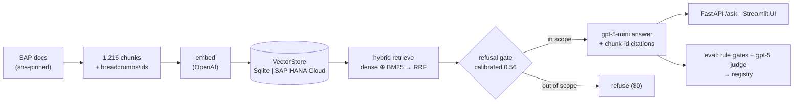

# BTP_RAG — Grounded RAG over SAP BTP documentation

A retrieval-augmented assistant over **SAP BTP docs** (AI Core, HANA Cloud Vector Engine, AI
Launchpad) with **SAP HANA Cloud Vector** as the production store: grounded answers with
**chunk-level citations**, a calibrated **refusal gate** for out-of-scope questions, and an
**adversarial eval harness** wired into CI.

**📐 Read [`docs/DESIGN.md`](docs/DESIGN.md)** — the full design in one document.
Reference: [`docs/SUPPORT.md`](docs/SUPPORT.md) · roadmap: [`docs/FUTURE.md`](docs/FUTURE.md) ·
decision history: [`docs/archive/`](docs/archive/).

## Why RAG — measured, not assumed
Same model (`gpt-5-mini`), same 40 questions, same `gpt-5` judge — with vs without retrieval:

| | **RAG** | no retrieval |
|---|---:|---:|
| correctness (LLM-judged) | **0.962** | 0.575 |
| gold facts present (deterministic) | **22/27** | 6/27 |
| out-of-scope control | **7/7 refused** | 1/7 — answered 6/7 ungoverned |
| verifiable citations | 32/33 valid | impossible |

## v1 results (40-item gold set, 17 adversarial)
faithfulness **0.983** · correctness **0.962** · refusal **7/7** (0 false) · citation validity
**32/33** · hit-rate@5 **76%** · ~$0.0012/answer · eval in ~2 min (8-way concurrent, 5× speedup).
Every run is fingerprint-stamped (models+params+prompt+gold+corpus hashes) and recorded in
[`eval/registry.jsonl`](eval/registry.jsonl) with per-item archives.

## Architecture

Full diagram + decisions: [`docs/DESIGN.md`](docs/DESIGN.md).

## Production practices in this repo
CI gates on every PR (lint + tests; retrieval PRs also run deterministic eval gates) ·
**nightly drift detection** (rebuilds from live SAP docs, triage matrix) · hallucination
detection via faithfulness judging · experiment fingerprint + run registry · two-track
store (cloud prod / local fallback) · calibrated refusal · versioned prompts · `uv.lock`
reproducible env · secrets via env only.

## Quickstart
```bash
pip install -e ".[dev]"                        # or: uv sync
./corpus/fetch.sh                              # fetch the 3 SAP docs (© stays local, gitignored)
python3 ingest/chunk.py                        # → ingest/out/chunks.jsonl (1,216 chunks)
PYTHONPATH=. python3 ingest/embed.py           # embed → local SQLite (~$0.005)
PYTHONPATH=. python3 eval/gates.py             # deterministic quality gates
PYTHONPATH=. python3 -m uvicorn app.main:app   # serve → http://localhost:8000/docs
```
Needs `.env` (see `.env.example`): `OPENAI_API_KEY`; optionally HANA creds + `STORE=hana`
to run the identical pipeline on SAP HANA Cloud.

## Layout
`config.py providers.py prompts.py core.py` kernel · `corpus/` acquisition+manifest ·
`ingest/` chunk+embed+load · `retrieve/` store+hybrid+generate · `app/` FastAPI ·
`eval/` gold(7 types)+judges+gates+registry · `tests/` + `.github/workflows/` CI ·
`docs/` design/support/future · `chunking/` frozen prototype.
